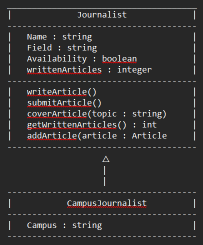
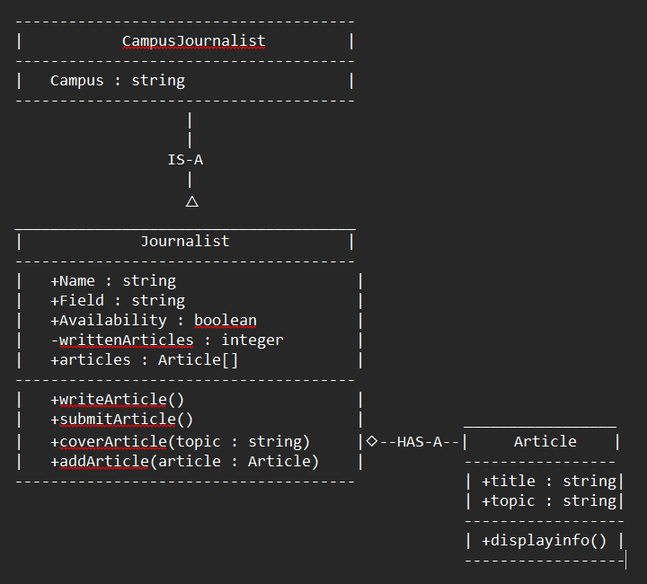
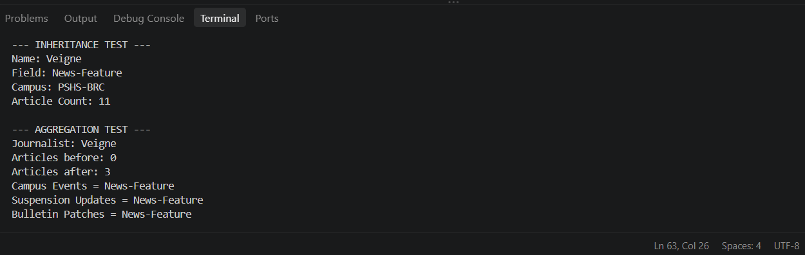
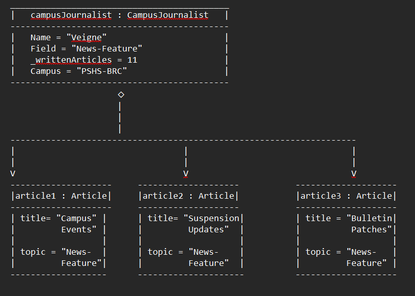

# Advanced Class Relationships
## Previous Activities
[classAttrib](classAttributesMethods.md)
[classRel](classRelationships.md)

## Existing System Description:
The existing system is based on the Journalist class and the Article class. The former class has attributes like Name, Field, Availability, and writtenArticles. Moreover, it also has methods for writing, submitting, and covering articles. The said classes share this one-to-many relationship since one Journalist could be assigned or associated with zero or more Article objects (Article assignments if we correlate it IRL). In connection to OOPAct 4, this seeks to improve the ongoing system by adding an inheritance and aggregation relationship.
## Inheritance Relationship
Campus Journalist
IS-A
Journalist
Parent: Journalist
Child: Campus Journalist
Explanation: A Campus Journalist is a type of the parent Journalist because campus journalists perform their duties like professional ones, but not beyond their campus vicinities. 

## Inheritance UML

## Composition/Aggregation
Relationship: Aggregation --- Journalist HAS-A Article
Explanation: The Journalist and Article classes have an aggregtion relationship because a Journalist can be correlated with many Article objects, while the Article objects can exist as indepedent facets. The Article objects were created separately and added to the Journalist's `articles` list using `addArticle()`. Thus, the Article objects aren't dependent on the Journalist's existence.

## Advanced UML Diagram

## Python Implementation
[Source Code](advancedRelationships.py)

## Test Run

## Object Diagram

## Reflection
Answers: