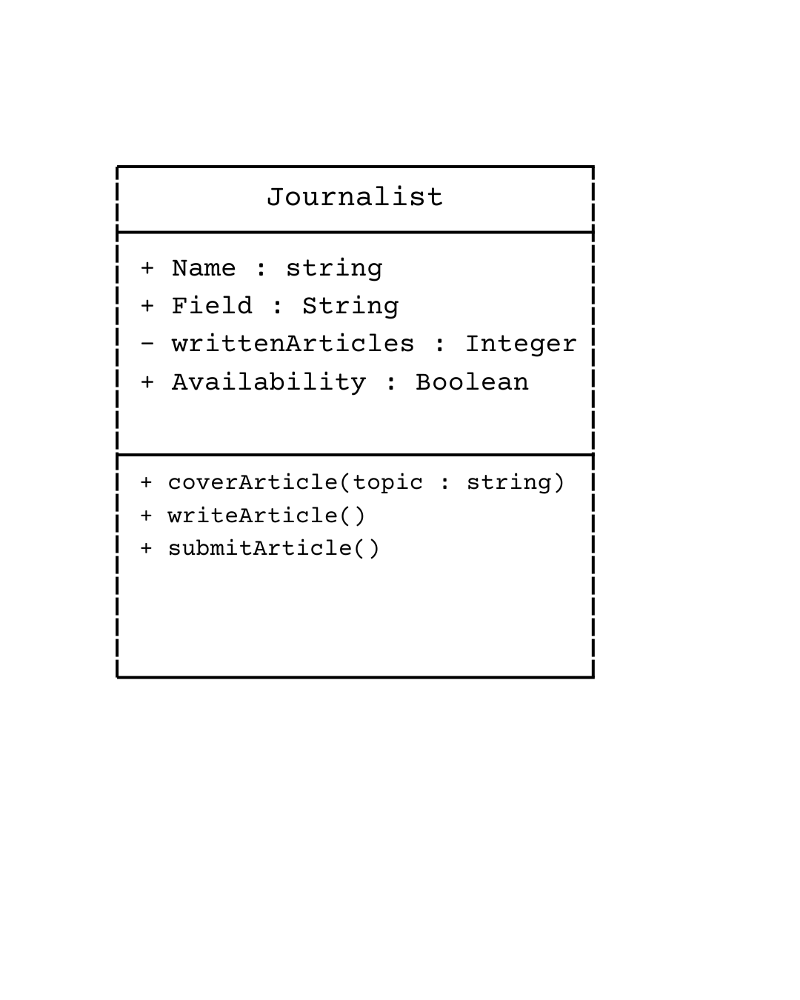
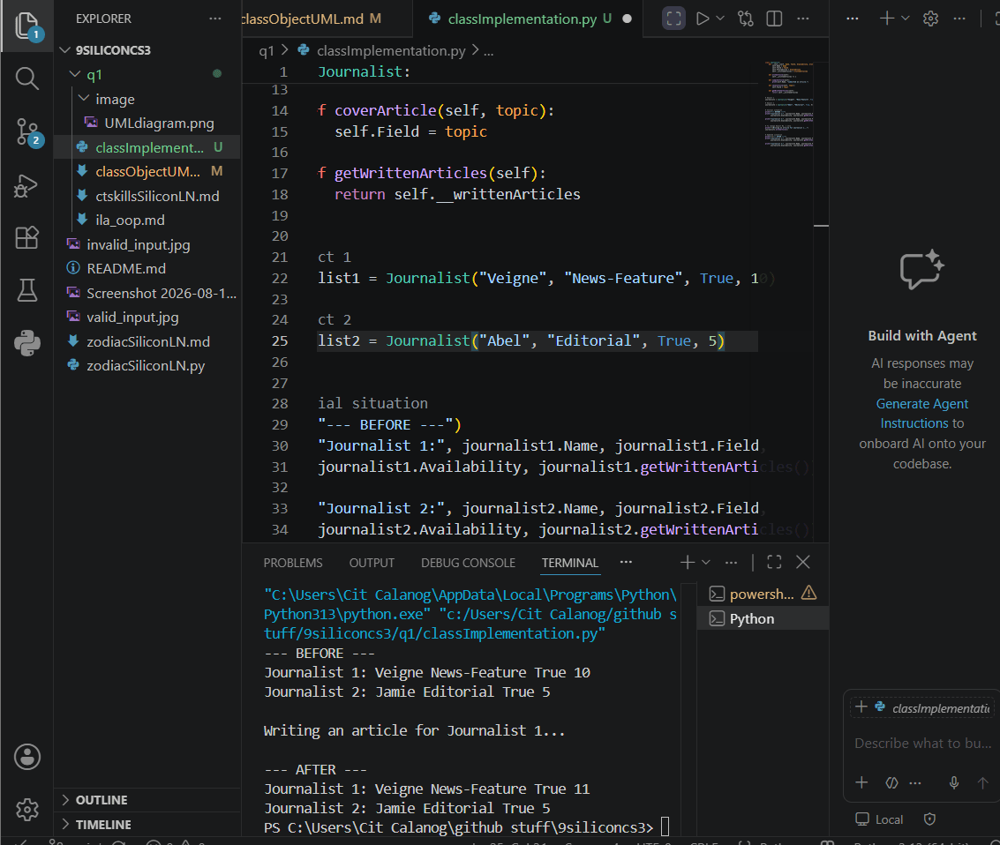
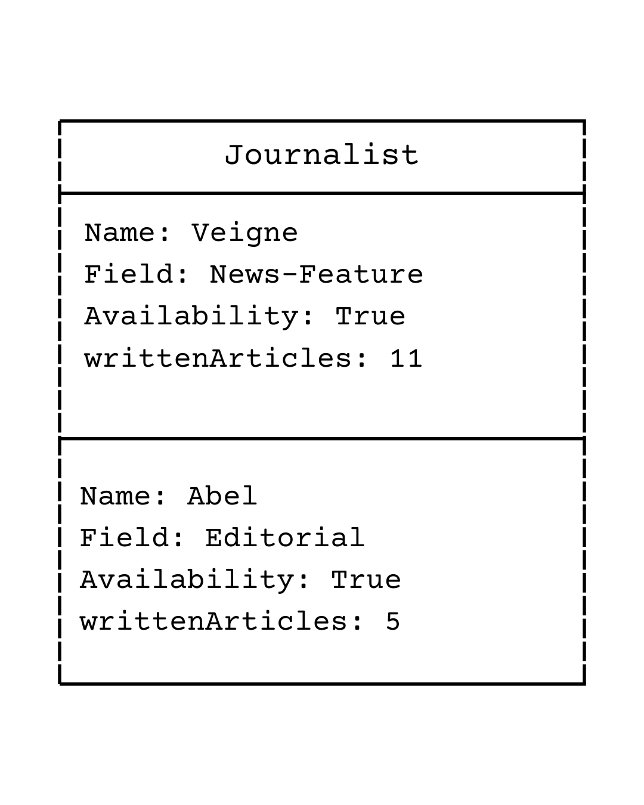

# Class Attributes and Methods

## Previous Design

[Previous Class Design](classObjectUML.md)

## Design Revision

The original class is a Journalist with the attributes Name, Field, Availability, and writtenArticles. The original methods are writeArticle(), submitArticle(), and coverArticle(topic : string). For this revised design, writtenArticles was changed to a private attribute to protect the journalist's article count, while the other attributes remain public. The original methods were kept because they are still relevant to the Journalist class.

## Visibility Decisions

| Attribute | Data Type | Visibility | Reason |
|---|---|---|---|
| Name | string | Public (+) | The journalist's name can be accessed to identify the object. |
| Field | string | Public (+) | The journalist's field can be accessed and changed when needed. |
| Availability | boolean | Public (+) | The journalist's availability can be checked directly. |
| writtenArticles | int | Private (-) | The number of written articles is kept private to prevent direct modification from outside the class. |

## Updated UML Class Diagram

## Python Implementation

[View Python Source](classImplementation.py)

## Test Run

## Object Diagram

## Analysis

### Why did you make your chosen attribute private?

I made writtenArticles() private because it dictates the number of articles written by the certain journalist. It should not be directly changed from outside because this could result in an incorrect article count. Making it private allows the class methods to control how the value is changed, thus helps protect the object's data.

### Which method changes the state of your object?

The writeArticle() method changes the state of the Journalist object by increasing the number of written articles by one. It alters the private writtenArticles attribute whenever an article is written. This means that the object's updated stateafter calling is different from its initial state. The method therefore demonstrates how an object's attributes can change during program execution.

### How did your two objects demonstrate that instances are independent?

The two Journalist objects were created with different values for their attributes. When writeArticle() was called only on Journalist 1, its writtenArticles value increased while Journalist 2's value remained constant or unchanged. This goes to show that each object has its own set of attribute values. Changes made to one object do not automatically affect the other one.

### What is the difference between your class diagram and your object diagram?

The class diagram represents the general structure or blueprint of the Journalist class, including its attributes and methods. The object diagram represents actual instances of the class and shows the specific values stored by each object. The class diagram does not represent one specific journalist, while the object diagram shows the individual Journalist objects created in the program. Therefore, the class diagram describes what an object can have, while the object diagram shows what the objects actually contain.