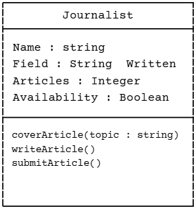

# SG 4: My OOP Seed System (Understanding Classes and Objects)

## Class Name
Journalist - Discipline of Verification

## Class Description

This Journalist class represents a functioning journalist deployed in the real world, wherein they are assigned to gather, write, publish, and protect information and news.

## Properties

|    Property    | Data Type | Visibility | Description    |
|----------------|-----------|--------|-------------------|
|     Name       |   String  | Public | Journalist's name |
|     Field      |   String  | Public |  What they mainly cover  |
| Articles Written | Integer  | Public | No. of written articles |
| Availability | Boolean | Private | Indicates the journalist's availability |

## Methods

| Method | Description |
|--------|-------------|
| coverArticle(topic : string) | Journalist is assigned to a certain topic which they will cover |
| writeArticle() | Creates a new article |
| submitArticle() | Submits the written article for final editing and publication |

## Class Diagram

## Design Explanation

### Why did you choose this class?
I chose this Journalist class because journalists play this immense and crucial role in gathering and sharing information with the public. They also hone the veracity of words they convey to the body, making them a pivotal thread in society's webbed tapestry.

### Which property is the most important? Why?
I believe that the Field property was the most important. It identifies what the assigned journalist mainly specializes in covering.

### Which method is the most useful? Why?
The coverArticle() method is the most feasible as it permits the journalist to be assigned to a particular area of coverage.