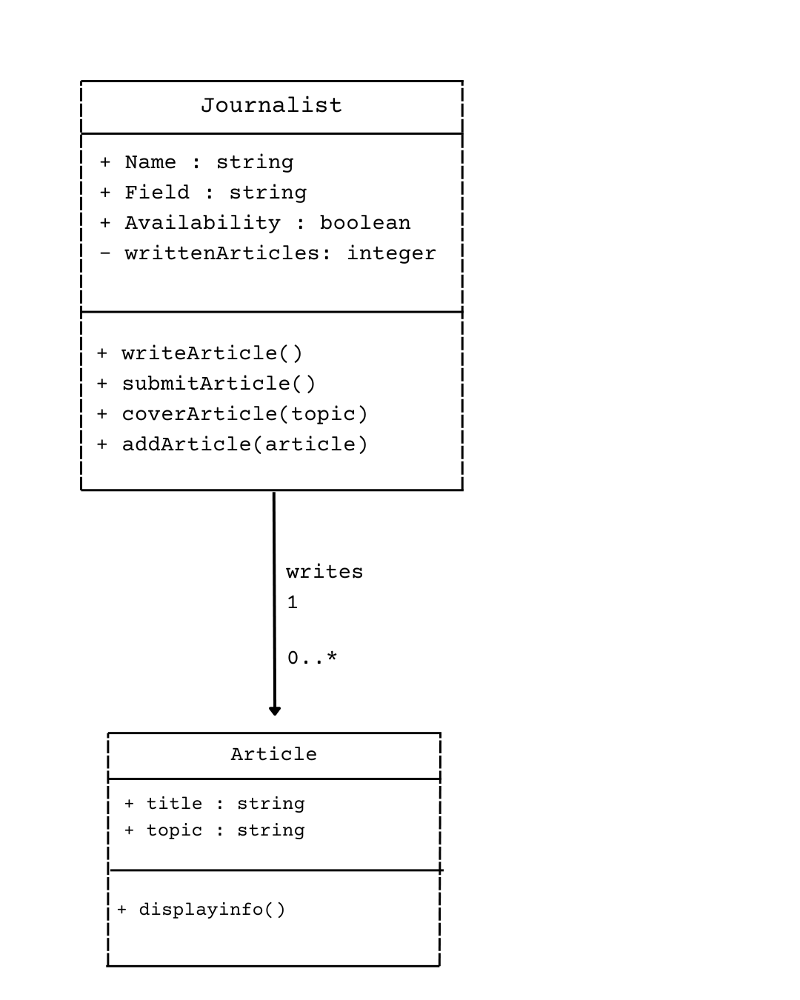
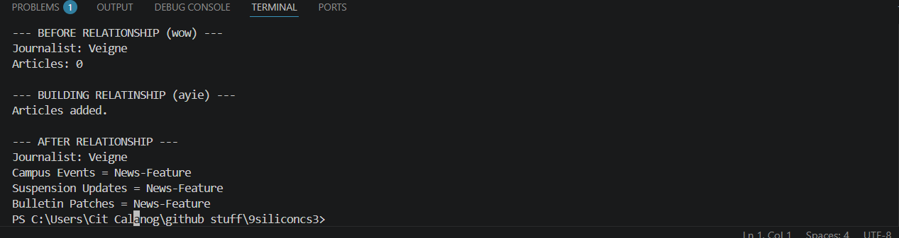

# Class Relationships

## Previous Class
[View Previous Class Design](classObjectUML.md)

## Relationship Design
The previous class I had created was the Journalist class, and now, its related class is Article. This is because one journalist can write or compose multiple articles, depending on how immense their workload is. In alignment with their actual work, a one-to-many relationship is observed between the two said classes.

## Relationship
**Journalist #1: o..* Article**

In this code, A Journalist can have zero or more Articles. The Journalist class stores the related Article objects in a list named "articles".

## Class Relationship Diagram

## Python Code
[View Python Source](classRelationships.py)

## Test Run

## Object Relationship Diagram

## Analysis